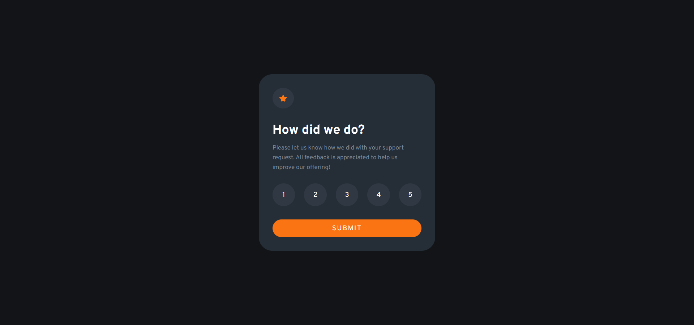

# Frontend Mentor - Interactive rating component solution

This is my solution to the [Interactive rating component challenge on Frontend Mentor](https://www.frontendmentor.io/challenges/interactive-rating-component-koxpeBUmI). Frontend Mentor challenges help you improve your coding skills by building realistic projects. 

## Table of contents

- [Overview](#overview)
  - [The challenge](#the-challenge)
  - [Screenshot](#screenshot)
  - [Links](#links)
- [My process](#my-process)
  - [Built with](#built-with)
  - [What I learned](#what-i-learned)
  - [Useful resources](#useful-resources)
- [Author](#author)

## Overview

### The challenge

Users should be able to:

- View the optimal layout for the app depending on their device's screen size
- See hover states for all interactive elements on the page
- Select and submit a number rating
- See the "Thank you" card state after submitting a rating

### Screenshot

### Links

- Solution URL: [solution](https://github.com/camilomcm/interactive-rating-component)
- Live Site URL: [live site](https://camilomcm.github.io/interactive-rating-component/)

## My process

### Built with

- HTML
- CSS
- Flexbox
- JavaScript

### What I learned

In this project I learned how to make a simple website interactive using the DOM through JavaScript.

### Useful resources

- [Active class JavaScript](https://www.w3schools.com/howto/howto_js_active_element.asp) - This helped me to understand how to add an active class to an element inside an array.

## Author

- Website - [Camilo Martínez Campos](https://camilomcm.github.io/portfolio/)
- Frontend Mentor - [@camilomcm](https://www.frontendmentor.io/profile/camilomcm)